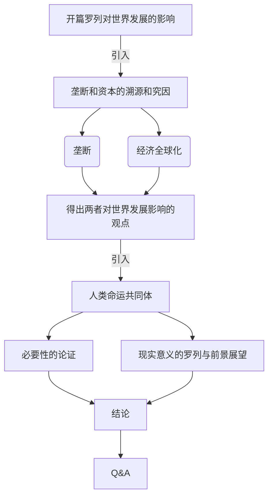
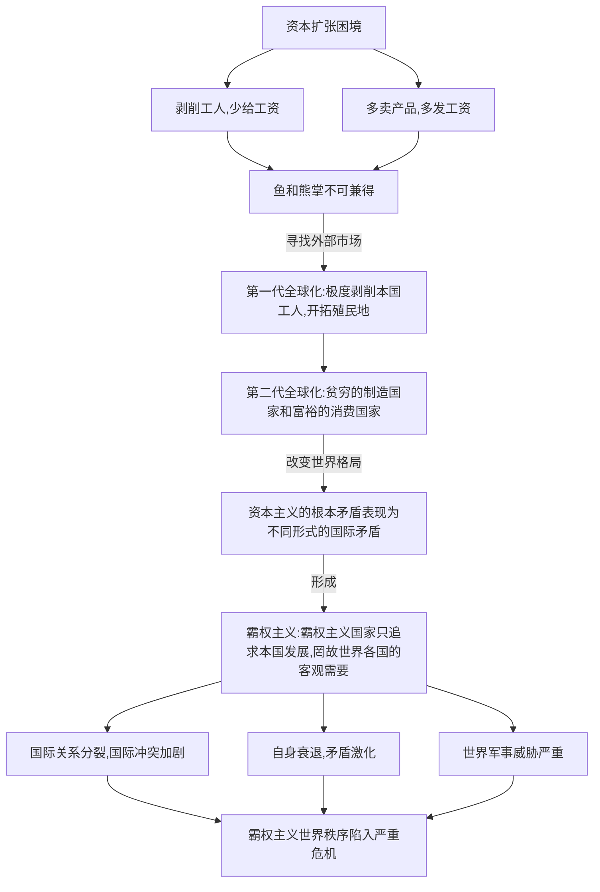

**论题：从垄断和资本主义经济全球化对世界发展所带来的影响说明构建人类命运共同体的必要性和现实意义**  

-----

展示思路参考：

---

说明：本文稿包含的是展示的参考思路和讲稿内容，幻灯片上的文字请同学根据设计的需要提取关键字等内容。

## Part 1 ...对世界发展所带来的影响(起题)

注：此部分内容建议作为入题使用，仅做简单的罗列，详细内容后面分解

### 积极影响（略）

1. 垄断资本主义客观上提高了主要资本主义国家的生产力水平，资本主义经济全球化的背景下对世界发展起到了一定的助推作用。
2. 经济全球化为各国平等参与全球性的经济分配提供了机会，并为经济相对落后的国家提供了助力。

### 消极影响

1. 垄断资本通过世界范围内的扩展，将国内的资本输出，将一些非要害基础输出，以此国外谋求高额利润，并且各垄断组织订立协议，在经济上瓜分世界。
2. 经济全球化市场的盲目性、自发性、滞后性等消极功能扩展到世界范围，把资本主义经济政治发展的不平衡性从一国扩展到世界范围，对发展中国家形成经济霸权威胁的同时也给世界带来了资本主义所固有的周期性波动和经济危机爆发

## Part 2.1 垄断资本主义溯源(承题)

#### 一、资本主义基本矛盾与垄断资本主义起源

&emsp;&emsp;资本来到世间，从头到脚，每个毛孔都流着血和肮脏的东西。（马克思）

&emsp;&emsp;在封建社会末期，在小商品生产者两极分化的基础上，资本主义生产关系开始萌芽，商业发展和资本原始积累加速形成。资本原始积累的过程就是征服、奴役、掠夺、杀戮的过程，用暴力手段剥夺小生产者的生产资料，并使劳动者沦为雇佣工人。资本主义经济制度是以资本主义私有制和雇佣劳动为基础的一种剥削制度。资本主义经济制度的形成是以劳动力成为商品为前提的。在此意义上，资本家与工人的关系在形式上是“自由”“平等”的买卖关系，但是实质上就是资本家支配和剥削工人的雇佣劳动关。  

&emsp; &emsp;19世纪70年代以前,资本主义处于自由竞争阶段；从19世纪70年代开始,自由竞争资本主义逐步向垄断资本主义过渡；19世纪末20世纪初,垄断代替自由竞争并占据统治地位,垄断资本主义得以形成。这一时期,垄断资本主义主要以私人垄断资本为基础,所以又叫私人垄断资本主义。私人垄断资本主义是在生产集中和资本集中的基础上形成的。  

#### 二、垄断资本主义的形式与本质

&emsp;&emsp;垄断是通过一定的垄断组织形式实现的。垄断组织是指在一个或几个经济部门中,占据垄断地位的大企业联合。

&emsp;&emsp;垄断组织的形式多种多样,而且在各个国家、各个时期也不相同，但垄断组织的本质都是通过联合实现独占和瓜分商品生产和销售市场，操纵垄断价格，攫取高额垄断利润。 

 #### 三、国家垄断资本主义的形成与发展

1. 国家垄断资本主义最早可追溯到二战时期的罗斯福新政。英国经济学家凯恩斯为国家垄断资本主义提供了理论基础。

2.  第二次世界大战后,在所有发达资本主义国家,国家垄断资本主义无论在广度上还是深度上都有了更迅速、更普遍的发展，国家干预深入资本主义的生产、流通、分配和消费的各个环节，国家垄断资本主义作为一种新的垄断资本主义生产关系体系最终得以确立。  

3. 垄断资本在世界范围内的扩展

   ​		垄断资本向世界范围扩展的主要经济动因是将国内过剩的资本输出,以便在国外谋求高额利润；将部分非要害的技术转移到国外,以取得在别国的垄断优势,搜取高额垄断利润；争夺商品销售市场,确保原材料和能源的可靠来源。 

   ​		垄断资本向世界范围的扩展是通过跨国公司这一国际垄断组织形式实现的。

#### 四、国家垄断资本主义发展的必然性

1. 社会生产力的发展,要求资本主义生产资料在更大范围内被支配,从而促进了国家垄断资本主义的产生
2. 经济波动和经济危机的深化,要求国家垄断资本主义的产生 
3. 缓和社会矛盾,协调利益关系,要求国家垄断资本主义的产生

#### 五、国家垄断资本主义的局限性

1. 国家垄断资本主义是垄断资本主义的新发展，它通过对政府资源的运用，国家反过来又对垄断资本主义进行调节和干预，使其达到了私人垄断所无法企及的高度，其对于资本主义经济的发展产生了积极的作用。
2. 国家垄断资本主义并没有根本改变垄断资本主义的性质。国家垄断资本主义的出现是资本主义经济制度内的经济关系调整,并没有从根本上消除资本主义的基本矛盾。国家垄断资本主义在本质上是资产阶级国家力量同垄断组织力量结合在一起的垄断资本主义，加强了对劳动人民的剥削和掠夺,更好地保证了垄断资产阶级的高额垄断利润,更有利于维护资本主义制度。

## Part 2.2 经济全球化的起源及其危机(承启)

此部分内容较复杂，可参考如下思维导图:

---

#### 一、资本扩张及其两难困境

&emsp;&emsp;资本要实现最大程度的增值，面临两难境地

1. 从劳动力市场的要求来看，资本要最大程度地增殖必须使劳动者永远处于贫困状态，尽可能少给工人工资，以此从工人身上剥削更多的剩余价值。

2. 从产品消费市场的要求来说，资本要实现增殖又必须使工人具有随着资本积累而不断增长的购买力，只有如此才能使生产的商品能够卖得出去，这就要使工人摆脱贫困状态，其工资与工人的劳动生产率的增长同步。如果这个要求得不到满足，就必然会发生产品过剩的经济危机，从而无法实现资本家的资本增殖的目的。

   &emsp;&emsp;“鱼与熊掌不可兼得”，资本家的上述两项要求不可能同时实现，因此经济危机必然发生。如果资本主义是个封闭在某个国家的经济体系，这种经济危机必然常常发生。为了避免和延缓这种经济危机的发生，于是资本出现了寻找外部市场的强大冲动，由此形成了资本的全球化浪潮。

#### 二、第一代经济全球化表现形式和危机

&emsp;&emsp;第一代全球化的主要表现形式是开拓殖民地，打开落后国家的市场，用过剩产品交换落后国家的黄金白银，并且拿出一部分购买落后国家的原材料乃至奴隶。

&emsp;&emsp;这种资本主义全球化只是给工业资本家与商业资本家带来巨额利润，而带给全世界劳动人民的只是灾难与贫困： 贩卖黑奴给非洲黑人带来的是人道主义灾难，而给资本母国的白人劳动者带来的则是失业与 极度的贫困。这就注定了一次次经济危机仍然不断爆发。

#### 三、第二代经济全球化表现形式和结果

##### 表现形式

&emsp;&emsp;第二代全球化最显著的特点就是国际产业链的形成：需要低端劳动力的处于中段的制造部门转移到发展中国家，用资本权力最大化地榨取其剩余价值，使其成为贫穷的生产国；而资本的母国掌握资本控制权的两头：研发部门与品牌营销部门。

##### 结果

&emsp;&emsp;在这样的国际分工下，大量的剩余价值流向母国，发达国家成为富裕的消费国，产品价值由此得到实现。贫穷的生产国与富裕 的消费国相分离，资本对劳动力市场的要求与它对商品的消费市场的要求分别得到了满足，它增加了资本主义生产方式对生产力的容量，延缓了资本主义危机的发生。

&emsp;&emsp;这种资本全球化的方式也给世界格局带来了巨大改变，使资本主义根本矛盾表现为不同形式的国际矛盾。

#### 四、霸权主义的兴起及其恶劣后果

&emsp;&emsp;在政治军事上，霸权主义国家采取对关键资源的控制与对相关地区的武力威慑，以强大的军事力量作为其最终威慑手段。在经济手段上，利用货币霸权和资本输出，通过垄断性国际产业链和金融链，通过利用落后国家的廉价劳动力与自然资源，分割生产国的劳动人民创造的剩余价值，以转化为其超额利润。这正是当代国际垄断资本主义最基本的特性。

##### 恶劣后果

1. **霸权主义导致国际关系分裂，国际冲突加剧。**

   ​		在政治军事上，国际霸权必须通过政治军事结盟 才能实现，于是整个世界分裂为霸权国家的“同盟国”与非同盟国，以至“假想敌”，并且通过制造对立与冲突来强化同盟国对霸权国家的依赖。这就必然导致错综复杂、越演越烈的国际冲突、民族冲突、宗教冲突，进而导致国际恐怖主义蔓延。而在国际经济领域，霸权国家必须依靠在国际金融链上的金融霸权、国际产业链上的高科技霸权和国际市场的品牌霸权，为此必然千 方百计利用其货币霸权优势地位，频繁使用关税壁垒和经济制裁手段，来阻止发展中国家的高科技产业的发展和品牌发展。由此必然引起日趋激烈的国际经济冲突，导致经济上的国际分裂。这些政治军事和经济上的分裂，形成了对国际生产力发展的巨大阻碍。

2. **霸权政策也会导致霸权国家自身竞争力衰退与国内矛盾激化**

   ​		霸权国家通过国际金融链和国际产业链攫取全球剩余价值和财富，这种寄生性扩张方式也导致其自身基础性能力 的衰退−这是因为它导致其经济脱实向虚，产业空心化，于是基础制造业急剧衰退。而高科技产业与金融产业，无论从就业总量上还是就业结构上，都无法满足全社会的就业需要。

   ​		发达国家经济的过度金融化必然导致金融体系过度膨胀，一旦其膨胀程度超过实体 经济的承受能力，便会爆发金融危机和债务危机。

3. **维护霸权的成本越来越高昂，世界面临的军事威胁越来越严重**

   ​		霸权国家通过军事 上的绝对优势来维护其霸权的同时，也由于霸权主义遭受到越来越强烈的国际反抗，导致维护霸权的成本不断上升。发达国家也常常通过局部战争来维护霸权，使人类和平面临威胁。

##### 严重危机

​		**霸权主义世界秩序已经陷入严重危机**。霸权主义的国际经济关系和政治关系， 已经严重阻碍高度社会化的生产力−全球化生产力发展。因此，当今世界需要一种新型的国际生产关系与国际政治关系，这正是中国国家主席习近平倡导的世界各国人民“**共同建构人类命运共同体**”。

## Part 3 构建人类命运共同体的必要性和现实意义

### 一、人类命运共同体是什么？

​		构建人类命运共同体思想的丰富内涵，可以从政治、安全、经济、文化、生态五个方面来理解：

1. **政治上**，要相互尊重、平等协商，坚决摒弃冷战思维和强权政治，走对话而不对抗、结伴而不结盟的国与国交往新路。
2. **安全上**，要坚持以对话解决争端、以协商化解分歧，统筹应对传统和非传统安全威胁，反对一切形式的恐怖主义。
3. **经济上**，要同舟共济，促进贸易和投资自由化便利化，推动经济全球化朝着更加开放、包容、普惠、平衡、共赢的方向发展。
4. **文化上**，要尊重世界文明多样性，以文明交流超越文明隔阂、文明互鉴超越文明优越。
5. **生态上**，要坚持环境友好，合作应对气候变化，保护好人类赖以生存的地球家园。

### 二、构建人类命运共同体的必要性

1. 全球化生产力的发展是不可阻挡的历史潮流。由全球化生产力建立起来的全球网络，如国际交通通讯网络、国际产业链、金融链、互联网、物联网，等等，是人类文明发展的积极成果，也必然随着历史的发展而日益发展。**它所产生的问题，不是其本身所致，而是以它为载体的国际垄断资本力量所致。**

2. 生产力的发展要求它们不断摆脱霸权主义的控制，而由各国人民来掌握。各国人民之间内在联系只能越来越紧密深入，越来越休戚相关。适应这种生产力发展的新的生产关系与政治关系，正是各国人民同舟共济的“命运共同体”。**建构人类命运共同体将会成为替代第二代全球化的新的全球化方式**。
3. 人类命运共同体理论与传统的霸权稳定论、两极论或多极论有本质不同，它**强调世界各国人民的平等性，强调世界人民相互依赖、相互合作**，提出了很多创新型的新理念。人类命运共同体所倡导的平等理念和一体化理念，加深了世界各国人民的集体感和认同感，为世界各国人民积极参与全球治理，**建构新型国际政治秩序提供了科学理论指导，有利于推动国际秩序合理有序发展。**

### 三、构建人类命运共同体的现实意义

1. 构建人类命运共同体是破解“修昔底德陷阱”魔咒的新思路

   ​		传统大国崛起之所以容易掉入“修昔底德陷阱”，是因为相互竞争的大国缺乏同舟共济的命运共同体意识，最终在相互斗争中相互损害甚至走向毁灭。

   ​		如果说，传统大国各自生活在相互独立的孤岛上，21 世纪的大国则共同航行在同一个“诺亚方舟”上，各国既相互独立更休戚与共。“你死我活”的单赢博弈必然导致共同毁灭，只有既相互竞争又相互合作的多赢博弈才能让“诺亚方舟”成功地到达彼岸。

   ​		围绕大国崛起的历史道路与终极命运，以习近平为核心的新一代中央领导集体不仅对“国强必霸必战”的传统大国崛起之路进行了有效质疑，还基于中国智慧创造性地提出了以和平共赢为核 心的新型国际关系的中国方案，为中国和平发展并最终跳出“修昔底德陷阱”，避免“大国政治的悲剧”开辟了一条切实有效的路径。

2. 解决外资企业知识产权过度保护问题

   1. “人类命运共同体”理念是能将知识产权与人权冲突有机融合的新思路。

      ​		在面对少数大型外资企业过度对知识产权保护直至影响到人们特别是发展中国家人民的基本权利保障时，正确运用“人类命运共同体”理念，以人类进步与发展为总目标，合理借鉴 “包容增长”新理念。

   2. “人类命运共同体”理念是解决全球化发展出现的知识产权相关问题新理念。

      ​		全球化发展过程中，一些大国都希望在各方面能占据主导地位，包括知识产权保护等问题逐渐成为新经济下一些国家频繁提及的议题。少数国家通过对科技、金融、互联网行业的专利操控，通过非常规范式达到以知识产权保护为名衍生其他影响发展的目的。“人类命运共同体”理念正是有效结合了中国传统文化的精髓与中华民族宽广的胸襟，最终坚持“和”与“融”的理念，解决许多共同问题。发挥“人类命运共同体”的新智慧，可以为外资企业知识产权保护过度提供新的解决思路。

